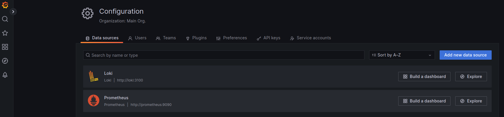
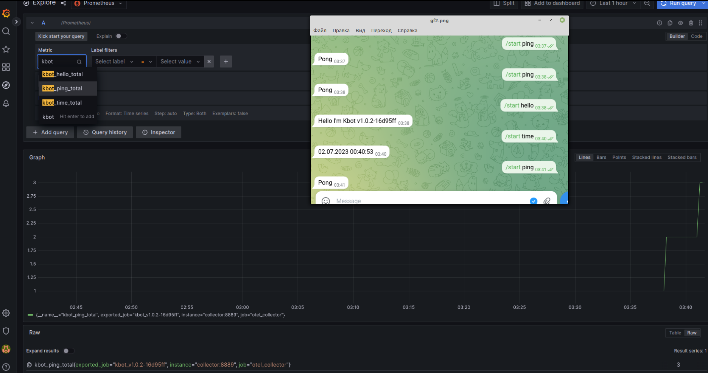
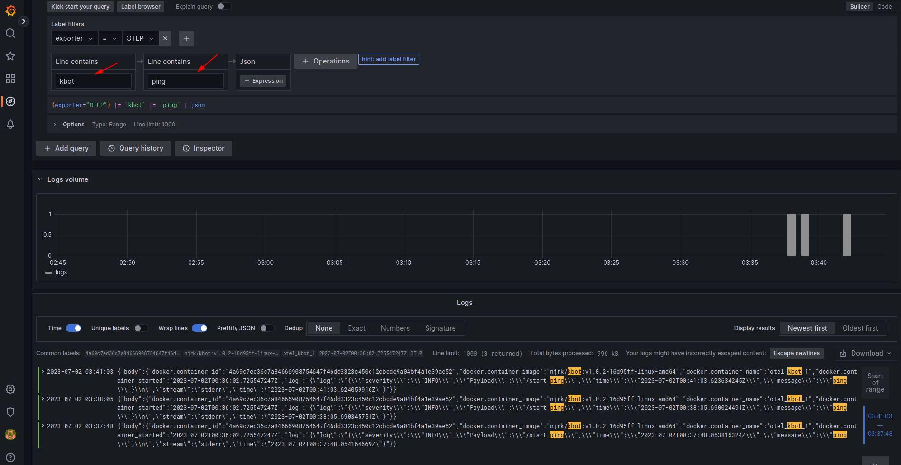
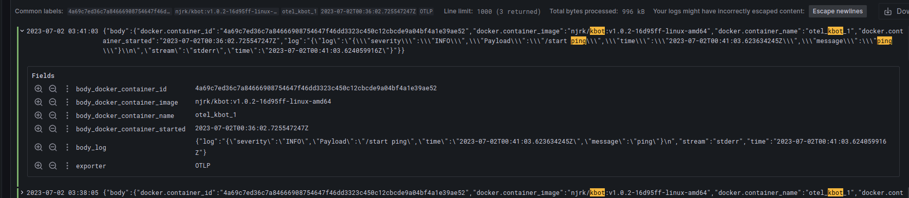

# Open-telemetry observability

Sample configuration for Kbot that send logs to [OpenTelemetry Collector] and metrics to [OpenTelemetry Collector] or [Prometheus].

## Prerequisites

- [Docker]
- [Docker Compose]

## How to run

1. Add telegram token
```bash
read -s TELE_TOKEN
export TELE_TOKEN
```
2. Add a password for Grafana
```bash
read -s GF_PASSWORD
export GF_PASSWORD
```
3. Run docker-compose
```bash
docker-compose -f otel/docker-compose.yaml up -d
```
## Demo

Created data sources:  


Explore metrics Prometheus:  


Explore logs Loki:  


Log parsing:  

